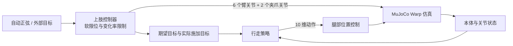

# TRON2 MJLab

[](pyproject.toml)
[](https://pypi.org/project/mjlab/1.6.0/)
[](#环境要求)
[](LICENSE)

**面向 SFYG_TRON2A 的 Ubuntu 22.04 强化学习训练基线。腿部策略负责行走，独立控制器负责机械臂与夹爪。**

基于 [mjlab](https://pypi.org/project/mjlab/)、MuJoCo Warp 与 PPO，
提供从官方模型准备、并行训练到策略回放的完整入口，使用 Bash 和 uv 管理环境，不依赖参考训练仓库。

> **项目定位**：用于平地运动控制、静态障碍环境与独立上肢控制的研究和开发。
> 仓库不附带训练成熟的策略，不包含抓取、末端跟踪或实机部署能力，也不承诺给定训练预算内收敛。

[快速开始](#快速开始) · [静态障碍](#静态障碍环境第一阶段) · [训练与回放](#训练与回放) · [控制设计](#任务与控制设计) ·
[上肢接口](#上肢控制接口) · [模型与资产](#模型与资产) · [常见问题](#常见问题) · [参与贡献](#开发与贡献)

## 项目特点

- **清晰的控制分工**：策略仅控制 10 个腿部关节；6 个机械臂关节和 2 个夹爪关节接受独立目标。
- **独立上肢控制**：平地任务默认生成平滑正弦目标，障碍任务默认保持姿态；两者都支持外部控制器接管。
- **静态障碍第一阶段**：提供平台、连续上下楼梯与沟隙跑道，以及可重复执行的几何和无头仿真检查；尚未实现视觉自主越障。
- **固定依赖与模型版本**：通过 uv 锁文件和官方模型的固定提交管理环境与资产，减少版本漂移。
- **独立任务扩展**：通过 Python 包入口点注册任务，不修改上游 mjlab 内置任务；默认本地记录 TensorBoard 日志，不上传模型。

## 环境要求

项目以 **Ubuntu 22.04 LTS、x86_64、NVIDIA GPU** 为主要运行环境。
下表中的软件版本由锁文件固定；GPU 和驱动需要在实际机器上验证，不保证所有硬件组合均可运行。

| 项目 | 配置要求 |
| --- | --- |
| 操作系统 | Ubuntu 22.04 LTS，x86_64 |
| GPU | 支持 CUDA 的 NVIDIA GPU，先以单 GPU 运行 |
| NVIDIA 驱动 | 需要兼容 CUDA 12.8；旧驱动的兼容库方案必须通过实际 GPU 测试 |
| Python | 默认 3.11，支持范围 `>=3.11,<3.13` |
| mjlab | 1.6.0 |
| PyTorch | 2.10.0+cu128 |
| MuJoCo / MuJoCo Warp | 3.11.0 |
| Warp | 1.17.0 |

依赖解析目标已设为 Linux。PyTorch 的 CUDA 运行库由锁文件安装，无需为了安装本项目替换系统 CUDA Toolkit；
但宿主机必须有可用的 NVIDIA 驱动。容器环境还需要宿主机正确透传 GPU。

Ubuntu 22.04 默认的系统 Python 3.10 不满足项目要求，使用 uv 管理的 Python 3.11 和项目虚拟环境即可，
**不要替换系统 Python，也不要把项目依赖装进已有 Conda 环境**。完整配置见
[pyproject.toml](pyproject.toml)、[.python-version](.python-version) 和 [uv.lock](uv.lock)。

### 当前验证范围

2026-09-26 已在 Ubuntu 22.04.5、Python 3.11.16、单张 A100 80GB 上通过依赖一致性检查、
CUDA 运算、任务注册和 100 次无头零动作仿真步进，并核对了 10 维动作、74 维策略观测与上肢目标保持行为。
该机器的宿主驱动为 535.129.03，同时提供 CUDA 12.8 兼容库；这是一组实测配置，不代表该驱动版本单独即可满足要求。

尚未验证原生桌面窗口、多 GPU 训练或长期策略收敛。安装成功与短时仿真通过不等于已经获得可用的行走策略。

静态障碍环境已通过全部 18 个地形单元的 CPU 射线检查，以及单张 A100 上 3 个环境各 100 步的
无头零动作检查，包括有限状态与奖励、足部接触、上肢目标保持、限速和重置。
这些检查不包含优化训练，不证明机器人能通过障碍或跳上 50cm 平台。

## 快速开始

以下命令使用 **Bash**。克隆后，除非另有说明，均在仓库根目录执行。

### 0. 准备系统工具

已安装对应工具时可跳过。系统软件安装需要管理员权限，NVIDIA 驱动请按机器或云平台要求单独配置。

```bash
sudo apt-get update
sudo apt-get install -y git curl libegl1 libgl1 libglfw3
curl -LsSf https://astral.sh/uv/install.sh | sh
export PATH="$HOME/.local/bin:$PATH"
```

`uv` 安装说明见[官方文档](https://docs.astral.sh/uv/getting-started/installation/)。
新终端若找不到 `uv`，重新执行上面的 `export PATH`，或将该路径加入自己的 shell 配置。

### 1. 获取代码

```bash
git clone https://github.com/WHYP2W/TRON_MJ_LAB.git
cd TRON_MJ_LAB
```

### 2. 安装依赖与模型

```bash
uv python install 3.11
uv sync --locked
bash scripts/setup_assets.sh
```

`uv` 会创建独立的项目虚拟环境。Linux 版 PyTorch、NVIDIA CUDA 运行库及其他依赖合计需要数 GB 下载空间，
安装与缓存还会额外占用磁盘，请预留充足空间。
资产脚本会下载固定版本的 SFYG XML 与网格，并检查关键文件是否存在；版本和路径规则见[模型与资产](#模型与资产)。

使用 VS Code 时，将 Python 解释器选择为项目中的 `.venv/bin/python`。
后续命令统一通过 `uv run` 执行，无需手动激活虚拟环境。

### 3. 检查 GPU 环境

```bash
nvidia-smi
uv run python -c "import torch; print('PyTorch:', torch.__version__); print('CUDA:', torch.version.cuda); print('GPU available:', torch.cuda.is_available())"
```

确认驱动能识别 GPU，且 Python 检查输出 `GPU available: True`。若为 `False`，先处理驱动或依赖问题，再启动仿真。
这只是初步检查，CUDA 内核编译及模型仿真仍需通过下一步验证。

### 4. 运行零动作回放

无需检查点即可检查模型加载、仿真和独立上肢控制。
SSH 或无桌面服务器使用浏览器查看器：

```bash
CUDA_VISIBLE_DEVICES=0 uv run play Mjlab-Velocity-Flat-TRON2-SFYG-External --agent zero --viewer viser --num-envs 1
```

按终端打印的地址访问查看器。远程机器建议通过 SSH 端口转发访问，不要将未鉴权的查看器直接暴露到公网。

Ubuntu 桌面会话也可以使用原生 GLFW 窗口：

```bash
MUJOCO_GL=glfw CUDA_VISIBLE_DEVICES=0 uv run play Mjlab-Velocity-Flat-TRON2-SFYG-External --agent zero --viewer native --num-envs 1
```

原生窗口需要可用的图形显示会话，不适用于没有 `DISPLAY` 的普通 SSH 终端。
首次仿真需要编译 Warp 内核，可能耗时数分钟；后续运行会复用缓存。
`CUDA_VISIBLE_DEVICES=0` 将运行限制在第一张 GPU，可按需替换编号。

> 零动作不等于已学会站立或行走。机器人可能摔倒并触发自动重置，这不代表安装失败。
> 此步骤用于检查运行链路，不用于评估策略质量。

## 静态障碍环境（第一阶段）

本阶段为后续视觉越障研究提供环境基础，不改动原平地任务，不修改下载的官方 XML 或网格。
新增任务为 `Mjlab-Velocity-Obstacles-TRON2-SFYG-External`，仍使用 10 维腿部动作、74 维策略观测和
84 维价值观测；**尚无深度图输入、跳跃专用奖励、技能选择或成熟越障策略**。
当前目标以实现 TRON2 的仿真能力为优先，不宣称已复现论文的完整算法或实验结果。

每条跑道长 12m、宽 4m，机器人出生在平坦区域，距障碍前沿约 2m。地形固定不动，
按 6 个难度行、3 个障碍类型列生成；默认从最低难度出生，当前没有自动升级难度的课程。
平台和楼梯横跨整个跑道，越过跑道边界会结束回合，避免从相邻跑道绕过障碍。

| 类型 | 地形参数 | 说明 |
| --- | --- | --- |
| 单个平台 | 高度 5–50cm，顶部长度 1.5m | 50cm 是场景目标，不是已验证的跳跃能力 |
| 连续楼梯 | 每级高 5–15cm、踏面深 30cm，4 级上行后下行 | 仿真起始尺寸；实际建筑规范适用性需另行核对 |
| 沟隙 | 宽度 10–60cm、深度 1m | 用于探索的范围，不是对实机最大跨距的建议 |

障碍任务的上肢设置 `automatic_motion=False`，默认保持初始姿态，外部目标仍持续有效，
直到被替换、释放或环境重置。足部接触传感器同时覆盖跑道地面、平台、台阶与沟底。
地形、难度参数和边界终止逻辑位于 [src/tron2_mjlab/env_cfg.py](src/tron2_mjlab/env_cfg.py)。

### 重复验证

使用已安装依赖的项目解释器运行 CPU 几何、任务注册及上肢控制检查，不需要 GPU 或机器人模型资产：

```bash
.venv/bin/python scripts/check_obstacles.py
```

确认 CUDA 和模型资产可用后，使用一张空闲 GPU 运行小规模无头检查，不训练策略：

```bash
CUDA_VISIBLE_DEVICES=0 MUJOCO_GL=egl .venv/bin/python scripts/check_obstacles.py --simulate --num-envs 3 --steps 100
```

脚本检查全部难度下的出生区、平台高度、楼梯上下行和沟底落差；仿真模式另外检查
动作观测维度、非有限值、三类跑道的足部接触、手动上肢目标、变化率限制和重置行为。
检查通过会输出 `"result": "PASS"`。零动作检查不会测试实际越障成功率。

### 浏览器预览

```bash
CUDA_VISIBLE_DEVICES=0 uv run play Mjlab-Velocity-Obstacles-TRON2-SFYG-External --agent zero --viewer viser --num-envs 3
```

三个环境分别对应平台、楼梯与沟隙，默认查看最低难度。按终端输出的地址访问；已有回放占用 GPU 时，
应改用空闲 GPU，不要中断其他回放或重复启动训练。远程访问仍使用 SSH 端口转发。

新任务的训练日志使用独立目录：

```text
logs/rsl_rl/tron2_sfyg_obstacles/<timestamp>/
```

当前观测和动作布局与平地任务相同，但不能据此认为平地策略会越障；任务的速度范围、上肢默认行为和
终止条件已有区别。后续加入地形感知或深度图时需要重新评估检查点兼容性，不应盲目续训旧模型。

## 训练与回放

### 启动训练

```bash
CUDA_VISIBLE_DEVICES=0 uv run train Mjlab-Velocity-Flat-TRON2-SFYG-External --env.scene.num-envs 64 --agent.max-iterations 1500
```

建议从默认的 64 个并行环境开始；显存不足时，可将 `64` 改为 `16` 或 `32`。
即使有多张 GPU，也先用上面的单 GPU 命令验证环境与训练配置，不要把 GPU 数量等同于已配置分布式训练。
**每次只运行一个训练进程。** `1500` 是当前默认迭代预算，不是策略收敛或达到特定性能的保证。

从仓库根目录启动时，日志和检查点写入：

```text
logs/rsl_rl/tron2_sfyg_external/<timestamp>/
```

### 查看训练日志

```bash
uv run tensorboard --logdir logs/rsl_rl --host 127.0.0.1
```

默认使用 TensorBoard，无需登录 W&B，模型上传功能默认关闭。远程使用时通过 SSH 转发 TensorBoard 端口。

### 从检查点续训

将 `<run-directory-name>` 替换为实际运行目录名，并选择该目录中已有的检查点文件：

```bash
CUDA_VISIBLE_DEVICES=0 uv run train Mjlab-Velocity-Flat-TRON2-SFYG-External --agent.resume True --agent.load-run "<run-directory-name>" --agent.load-checkpoint "model_100.pt"
```

续训必须保持任务、观测和动作结构一致。修改这些结构后，应重新评估检查点兼容性；
Isaac Lab 参考项目的检查点不能直接用于本任务。

### 回放训练结果

将 `<run>` 和检查点文件名替换为本地实际值：

```bash
checkpoint='./logs/rsl_rl/tron2_sfyg_external/<run>/model_100.pt'
CUDA_VISIBLE_DEVICES=0 uv run play Mjlab-Velocity-Flat-TRON2-SFYG-External --checkpoint-file "$checkpoint" --viewer viser --num-envs 1
```

## 任务与控制设计

本项目注册以下任务，mjlab 通过 `mjlab.tasks` 包入口点自动发现它们：

| 任务 ID | 策略动作维度 | 默认策略观测维度 |
| --- | ---: | ---: |
| `Mjlab-Velocity-Flat-TRON2-SFYG-External` | 10 | 74 |
| `Mjlab-Velocity-Obstacles-TRON2-SFYG-External` | 10 | 74 |

### 控制分工



腿部使用位置控制。上肢控制项 `upper_body` 的 `action_dim` 为 `0`，因此不会占用策略动作维度，
策略也不会覆盖外部控制器的上肢目标。
策略可以观测上肢关节位置、速度、期望目标及经过限速后实际施加的目标。

### 默认配置

| 参数 | 默认值 |
| --- | --- |
| 地形 | 平面 |
| 并行环境数 | 训练 64；回放 1 |
| 物理时间步 | 0.005 s，200 Hz |
| 策略控制周期 | 0.02 s，50 Hz；每次策略步进包含 4 个物理步 |
| 单回合时长上限 | 20 s，终止条件可提前结束回合 |
| 前向速度指令 | -0.5 至 1.0 m/s |
| 横向速度指令 | 0 m/s |
| 偏航角速度指令 | -0.6 至 0.6 rad/s |

环境、奖励和观测配置见 [src/tron2_mjlab/env_cfg.py](src/tron2_mjlab/env_cfg.py)，
PPO 与训练器配置见 [src/tron2_mjlab/tasks.py](src/tron2_mjlab/tasks.py)。
上表为平地任务默认值。静态障碍任务另见第一阶段说明，当前仍不包含深度感知、操作任务奖励或仿真到实机验证。

## 上肢控制接口

接口用于已有的 `ManagerBasedRlEnv` 控制循环。下面假定 `env` 已通过 `make_env_cfg()` 对应配置创建，
`leg_actions` 为当前腿部策略输出，形状为 `(env.num_envs, 10)`。
示例展示设置上肢目标、推进一个环境步，然后释放外部控制；它不是独立训练脚本。

```python
import torch

upper_body = env.action_manager.get_term("upper_body")
targets = torch.tensor(
  [0.3, 0.5, -0.9, 0.1, 0.2, 0.0, 0.03, -0.03],
  device=env.device,
)
upper_body.set_targets(targets)
observations, rewards, terminated, truncated, info = env.step(leg_actions)
upper_body.release_targets()
```

### 目标格式与生命周期

- **顺序与单位**：`arm1_Joint` 至 `arm6_Joint` 使用弧度，随后是 `gripper1_Joint`、`gripper2_Joint`，使用米。两个夹爪关节的取值范围符号相反。
- **批量输入**：`(8,)` 会广播到所有选中环境；`(selected_envs, 8)` 用于逐环境设置目标。
- **环境选择**：`set_targets(targets, env_ids=...)` 接受环境索引张量或切片；省略 `env_ids` 时作用于全部环境。`release_targets()` 支持同样的选择方式。
- **目标保持**：手动目标持续有效，直到被替换、调用 `release_targets()` 或对应环境重置。释放后，平地任务恢复自动运动，障碍任务回到默认姿态。实时控制器应在每次步进前更新目标，重置后也不例外。
- **输入检查**：形状错误或包含非有限数值的目标会被拒绝；有效目标会裁剪到关节软限位内，并在物理步中逐步限速施加。

由于存在变化率限制，实际施加目标可能暂时落后于期望目标。当前仿真参数如下：

| 关节 | 刚度 / 阻尼 | 力或力矩上限 | 目标变化率上限 |
| --- | --- | --- | --- |
| 机械臂 | 40 / 4 | 30 Nm | 1.5 rad/s |
| 夹爪 | 100 / 5 | 10 N | 0.04 m/s |

这些参数是仿真起点，**不是经过标定的硬件限值**。
接口实现见 [src/tron2_mjlab/control.py](src/tron2_mjlab/control.py)，
关节顺序与执行器配置见 [src/tron2_mjlab/robot.py](src/tron2_mjlab/robot.py)。

## 模型与资产

### 来源与版本

模型来自 [LimX 官方机器人描述仓库](https://github.com/limxdynamics/tron2-robot-description)，
[scripts/setup_assets.sh](scripts/setup_assets.sh) 使用稀疏检出获取 SFYG XML 与网格目录，保留上游许可证和声明。
固定模型提交为 [`f547f5bc949f2a4c98e076e61cf6d3ca73d179a0`](https://github.com/limxdynamics/tron2-robot-description/tree/f547f5bc949f2a4c98e076e61cf6d3ca73d179a0)。

默认加载位置：

```text
assets/robot-description/tron2a/SFYG_TRON2A/xml/robot.xml
```

资产脚本会拒绝覆盖有本地修改、版本不符或不是 Git 检出的已有目录。
遇到此类错误时，请先检查并保留已有工作，不要直接删除修改后的模型。

### 使用已有模型副本

在启动训练或回放的同一个 Bash 会话中设置：

```bash
export TRON2_ASSET_ROOT="$HOME/models/tron2-robot-description"
```

该路径必须指向**包含 `tron2a/` 的兼容模型仓库根目录**，而不是 XML 所在目录。
此变量只影响运行时模型查找；资产脚本仍在项目默认资产目录中准备模型。

### 模型适配原则

适配器只修改内存中的模型描述，官方 XML 和网格文件保持不变：

- 移除独立模型自带的地面和电机，添加 mjlab 执行器及足部、工具定位点。
- 按 MuJoCo Warp MULTICCD 的要求将碰撞裕量设为零；场景时间步和接触容量由 mjlab 配置管理。
- 保留髋偏航初始偏置，左侧为 `-pi`、右侧为 `+pi`；不通过焊接关节锁定上肢。

模型资产、虚拟环境、缓存、日志和检查点均保存在本地，不纳入 Git 或 Python 分发包。

## 代码导航

| 入口 | 职责 |
| --- | --- |
| [pyproject.toml](pyproject.toml) | 包元数据、依赖、CUDA 索引与 mjlab 任务发现入口 |
| [src/tron2_mjlab/__init__.py](src/tron2_mjlab/__init__.py) | 包导入时触发任务注册 |
| [src/tron2_mjlab/tasks.py](src/tron2_mjlab/tasks.py) | 任务 ID、幂等注册、PPO 与日志配置 |
| [src/tron2_mjlab/env_cfg.py](src/tron2_mjlab/env_cfg.py) | 场景、动作、观测、奖励、终止条件与仿真参数 |
| [src/tron2_mjlab/control.py](src/tron2_mjlab/control.py) | 独立上肢目标管理、自动运动与限幅限速 |
| [src/tron2_mjlab/robot.py](src/tron2_mjlab/robot.py) | 模型加载、关节定义、初始姿态与执行器配置 |
| [scripts/setup_assets.sh](scripts/setup_assets.sh) | Bash 资产准备入口，固定模型版本并保护已有修改 |
| [uv.lock](uv.lock) | 完整依赖解析结果 |

## 常见问题

| 现象 | 排查与处理 |
| --- | --- |
| `uv: command not found` | 安装 uv，并将 `$HOME/.local/bin` 加入 `PATH`。 |
| 系统 Python 3.10 不满足要求 | 执行 `uv python install 3.11`，再运行 `uv sync --locked`，不要替换 Ubuntu 的系统解释器。 |
| 从 Windows 复制来的虚拟环境无法使用 | 不同平台的虚拟环境不能复用。保留必要文件后移走旧环境，在 Ubuntu 上重新运行 `uv sync --locked`。 |
| `GPU available: False` | 检查 `nvidia-smi`，确认驱动可用，并通过项目的 `uv run` 使用已锁定的 CUDA 版 PyTorch。 |
| CUDA 驱动不足或 PTX 版本不受支持 | 确认驱动与 CUDA 12.8、Warp 内核兼容；涉及驱动或兼容库变更时由机器管理员处理，不要仅凭 GPU 可见就认为环境兼容。 |
| 首次启动长时间没有画面 | 首次仿真会编译 Warp 内核，可能耗时数分钟；检查终端是否仍在编译或已报告错误。 |
| `Official YG model not found` | 运行资产脚本，或检查 `TRON2_ASSET_ROOT` 是否包含预期的 `tron2a/SFYG_TRON2A/xml/` 目录。 |
| 资产脚本拒绝已有目录 | 检查资产提交版本及本地修改。脚本的保护行为是预期设计，不应通过覆盖已有工作来绕过。 |
| SSH 下 GLFW 报错或没有 `DISPLAY` | 使用 `--viewer viser`。原生查看器必须在有图形显示的会话中运行，不要通过伪造 `DISPLAY` 绕过。 |
| 缺少 EGL 或 OpenGL 动态库 | 检查系统图形库和 GPU 透传；按快速开始安装对应运行库。无头仿真和桌面查看器的前置条件不同。 |
| 训练显存不足 | 将 `--env.scene.num-envs` 降至 `16` 或 `32`，并确认没有并行运行多个训练进程。 |
| 任务无法找到 | 从仓库根目录完成 `uv sync --locked`，再通过 `uv run train` 或 `uv run play` 调用，避免使用其他 Python 环境的入口。 |
| 零动作回放时摔倒或反复重置 | 零动作没有学习到平衡能力；检查点训练效果应单独评估。 |
| 检查点加载时维度不匹配 | 确认任务、策略观测、动作结构与训练时一致；不能直接加载 Isaac Lab 参考项目的检查点。 |

## 开发与贡献

欢迎通过 [Issues](https://github.com/WHYP2W/TRON_MJ_LAB/issues) 报告问题或讨论设计，
通过 [Pull Requests](https://github.com/WHYP2W/TRON_MJ_LAB/pulls) 提交改进。

报告问题时，请附上操作系统、GPU 与驱动版本、Python 与依赖版本、完整运行命令、错误日志和最小复现步骤。
涉及策略结果时，也请注明任务配置、环境数量、训练迭代数与检查点来源。

提交改动前：

1. 将任务改动限制在本项目中，避免直接修改已安装的上游 mjlab 包。
2. 安装依赖后执行下方语法检查；模型、控制或环境改动还应在支持的环境中运行零动作回放，并记录实际验证结果。
3. 观测、动作或目标接口发生变化时，同步更新文档，并说明检查点兼容性影响。
4. 有意调整依赖时同步维护锁文件；不要提交模型资产、虚拟环境、日志或检查点。

```bash
uv lock --check
uv run python -m compileall -q src/tron2_mjlab
bash -n scripts/setup_assets.sh
```

当前仓库尚未配置自动化测试套件、lint 检查或 CI 工作流。
上述语法检查不验证依赖导入、GPU 仿真、任务运行或训练收敛；零动作回放也不能替代控制行为测试与策略评估。

## 许可证与致谢

本仓库源代码采用 [Apache License 2.0](LICENSE)。下载的机器人 XML、网格和其他第三方资源遵循各自上游许可证；
本项目许可证不替代这些资源的许可条款，使用与再分发时应保留相应许可证及声明。

本项目基于以下开源工作：

- [mjlab](https://pypi.org/project/mjlab/)：环境、任务与训练集成。
- [MuJoCo](https://mujoco.org/) 与 [MuJoCo Warp](https://pypi.org/project/mujoco-warp/)：物理仿真。
- [RSL-RL](https://github.com/leggedrobotics/rsl_rl)：强化学习训练。
- [LimX Robotics 模型仓库](https://github.com/limxdynamics/tron2-robot-description)：官方 SFYG 机器人描述与网格资源。
